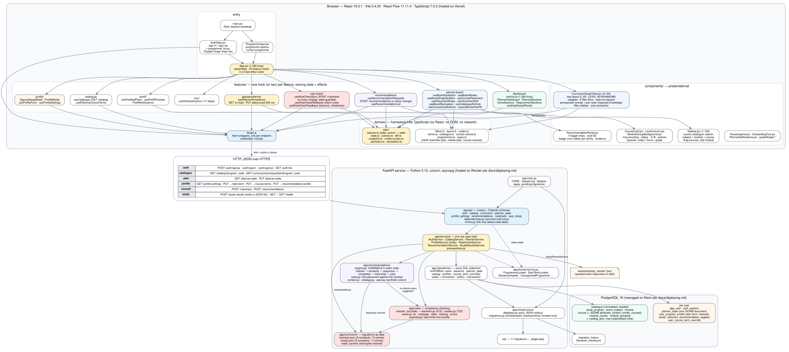
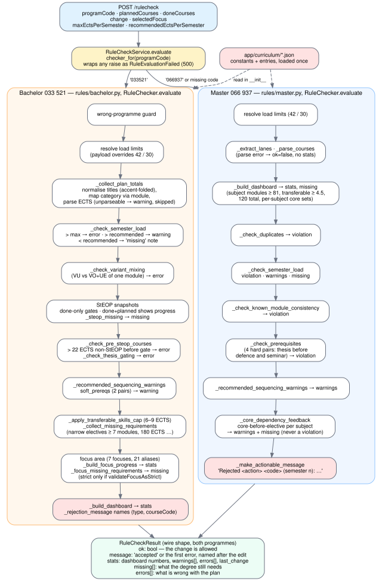
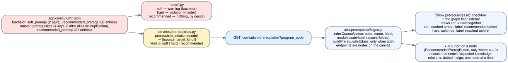
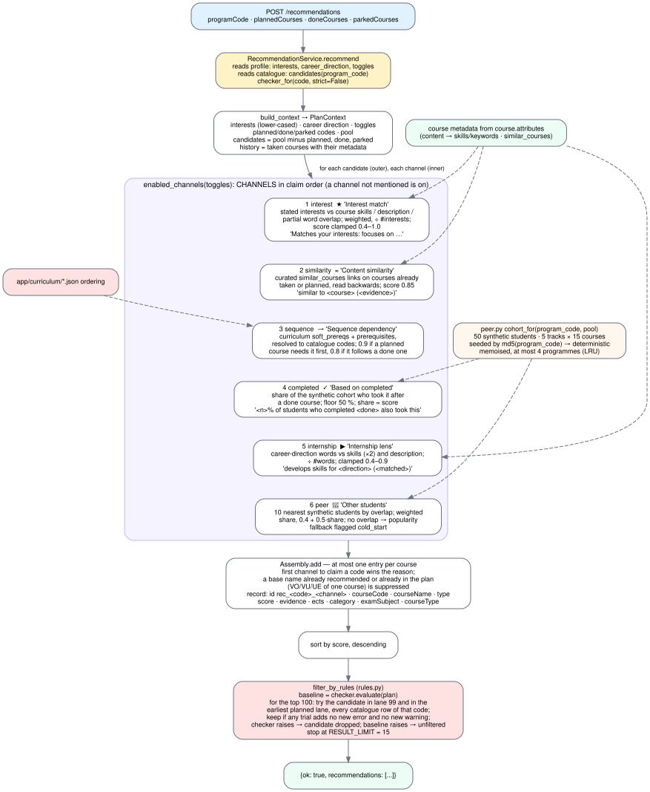
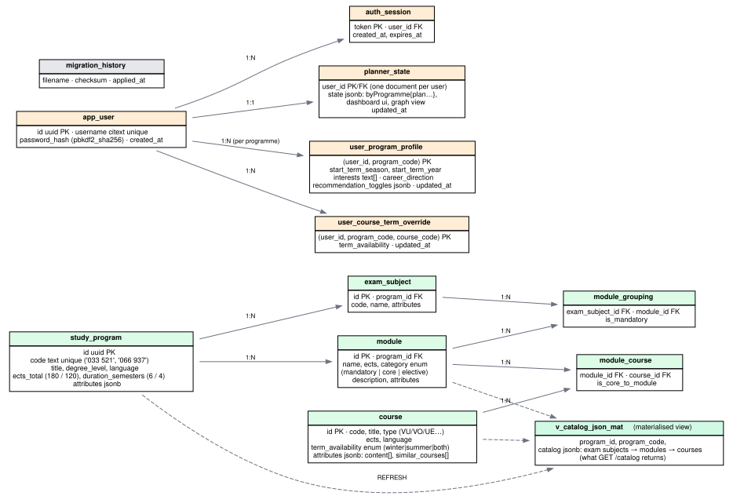
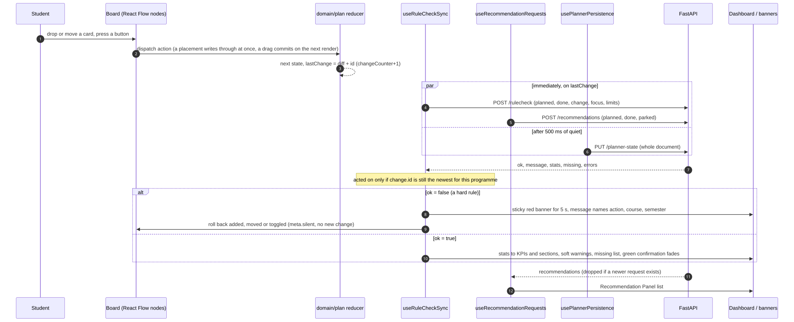
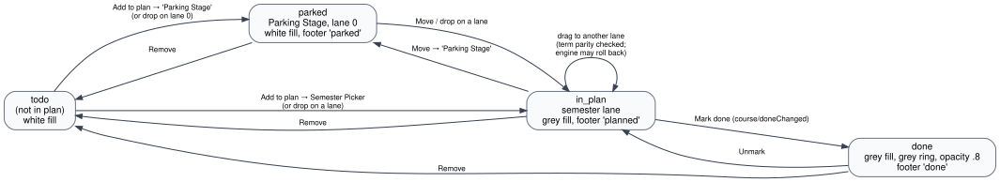

# The study planner as it stands on `main` of `hypridplanner`

A description of the code, written from the code, to check the thesis's claims against and to compare with Chapter 7.

Read on 2026-09-05 from `github.com/morischumacher/hypridplanner`, branch `main`, commit `c00ef4f` ("Initial commit", authored 2026-09-01). Nothing in this document comes from evaluation-study files or from the thesis; where the repository's own documentation makes a claim, the claim is marked as documentation and checked against the source where that is possible.

---

## 0. Provenance, and what this repository cannot tell us

**The repository has one commit and no history.** `git log` shows a single commit, `c00ef4f Initial commit`, dated 2026-09-01. There are no tags and no branches other than `main`. Three documents inside the repository refer to a tag `v1.0-evaluated` (README, `docs/thesis-map.md`, `docs/adr/0006`) and one to a branch `refactor/architecture` (`docs/deploying.md`). Neither exists here. So the question the thesis's rule asks second — *was this also true during the evaluation sessions?* — cannot be answered from git for any claim. It can only be answered from the repository's own documentation, which is testimony, and from Moritz.

**The documentation says the structure is post-evaluation.** Six architecture decision records in `docs/adr/`, all dated 2026-08-28, describe a refactor that "happened after the system had been evaluated with eleven students" (`docs/architecture.md`, last section). They describe the state before the refactor in numbers: a FastAPI application of roughly 3,700 lines with twenty-four SQL statements inline in five route modules (ADR 0001); two rule checkers of 2,220 lines together, the bachelor one with a 390-line constructor and a 550-line `evaluate` (ADR 0002); a 13,000-line JavaScript frontend with 6,664 lines in one component and 207 hooks in `App.jsx` (ADR 0003, 0004); sequentially numbered migrations (ADR 0005); and no tests at all (ADR 0006). The code on `main` has none of these properties. Every structural statement below therefore describes the refactored system, and a chapter that says "everything described up to this point is the system used in the evaluation study" is, for the *structure*, describing something else. The documentation's position is that behaviour was preserved exactly (golden masters, ADR 0006) except where a known defect was fixed deliberately; that is a claim this document can check only for consistency, not for truth.

**Size.** 106,796 lines in the repository, of which about 62,000 are recorded test fixtures (`backend/tests/golden/*.json`) and 4,200 are `package-lock.json`. The application itself is roughly: backend `app/` ≈ 5,300 lines of Python over 45 files; frontend `src/` ≈ 17,500 lines over 90 files, of which the largest are `CurriculumGraphView.jsx` (2,124), `App.jsx` (1,336), `Sidebar.jsx` (1,102) and `dashboard/metrics.ts` (1,060); SQL migrations ≈ 3,400 lines, most of it seeded catalogue and course metadata.

**Dependencies, pinned from the lock files.** React 18.3.1, React Flow 11.11.4, Vite 5.4.20, TypeScript 7.0.2, Vitest 2.1.9, Playwright 1.62.1; Python 3.12 (Dockerfile), FastAPI, uvicorn, asyncpg, pydantic-settings (unpinned in `requirements.txt`); PostgreSQL 16 (`docker-compose.yml`, CI).

**Hosting.** The only hosting configuration in the repository is `frontend/vercel.json` (an SPA rewrite). Render and Neon appear in `docs/deploying.md` as the API and database hosts, with an operational procedure written around them; there is no `render.yaml` or Neon configuration. The API expects `DATABASE_URL` and `CORS_ORIGIN` from the environment.

---

## 1. Architecture

*Figure 1. The three tiers and every module in them. Browser: entry, feature hooks, presentational components, the framework-free domain layer, and one API client. Service: routers, use cases, repositories behind a unit of work, the rule engine over the curriculum documents, the recommender, infrastructure. Database: the normalised catalogue with its materialised view, the per-user tables, and the migration ledger. Arrows are dependencies; dashed arrows are reads of data rather than calls.*

Three tiers, three processes, two of them stateless.

The **browser** runs a single-page React application. `main.jsx` bootstraps the session (`GET /auth/me`), shows `AuthGate.jsx` when there is none, and otherwise renders `App.jsx` inside a `ProgramProvider`. `App.jsx` is an assembly file: it calls some thirty feature hooks in a deliberate order and passes their results to the components. State lives in the hooks; the plan itself lives in a pure reducer in `src/domain/plan/`. The browser talks to the service through `src/lib/api.js`, one `fetch` wrapper per endpoint, with `credentials: "include"` so the session cookie travels.

The **service** is a FastAPI application. A request enters a router in `app/api/`, which validates it with a Pydantic model, calls exactly one method on a service from `app/services/`, and returns what the service gives it. Services reach storage through a unit of work (`app/repositories/unit_of_work.py`) that hands them every repository bound to one connection (`read()`) or one transaction (`write()`). The rule engine (`app/rules/`) and the recommender (`app/recommendations/`) are pure Python with no I/O; both read the curriculum documents in `app/curriculum/`. Failures are raised as named domain errors (`app/domain/errors.py`) and turned into status codes by one table in `app/api/errors.py`.

The **database** is PostgreSQL. The catalogue is normalised (programme → exam subject → module → course) and projected into a materialised view that already holds the nested JSON the interface wants. Per-user data is five tables, the plan among them as one JSONB document per user.

---

## 2. The backend

### 2.1 Entry point and lifecycle

`app/main.py` builds the `FastAPI` object, installs CORS (origins from `CORS_ORIGIN`, defaulting to the local Vite ports), a request-logging middleware, and a handler that maps every `DomainError` to a JSON response. On startup, inside the lifespan, it applies outstanding migrations (`apply_pending`) before serving anything. Two meta endpoints exist: `GET /` and `GET /health`, the latter doing a database round trip.

`app/settings.py` reads `DATABASE_URL`, `CORS_ORIGIN`, `USE_CATALOG_MAT` and `MIGRATIONS_DIR` from the environment or a `.env` file.

### 2.2 The HTTP surface

| Route | Auth | Service call | Notes |
|---|---|---|---|
| `POST /auth/signup`, `/auth/signin` | none | `AuthService.sign_up / sign_in` | sets a `session_token` cookie and returns the token; passwords are `pbkdf2_sha256`, 200,000 iterations |
| `POST /auth/signout`, `GET /auth/me` | cookie or bearer | `sign_out / identify` | |
| `GET /catalog?program_code=` | required | `CatalogService.for_programme` (or all) | reads the materialised view, then overlays the user's term overrides |
| `GET /curriculum/prerequisites?program_code=` | required | `prerequisites.prerequisite_relations` | `{programCode, relations:[{source,target,kind}]}`; 400 for an unknown programme |
| `GET /planner-state`, `PUT /planner-state` | required | `PlannerService.load / save` | the whole plan document, `{state: {...}}` |
| `GET /profile-settings?program_code=` | required | `ProfileService.get` | start term, interests, career direction, toggles, locks, term overrides |
| `PUT /profile-settings/start-term` | required | `ProfileService.set_start_term` | 409 `ProgrammeLocked` / `StartTermLocked` |
| `PUT /profile-settings/course-terms` | required | `set_course_terms` | per-course winter/summer/both overrides |
| `PUT /profile-settings/recommendation-profile` | required | `set_recommendation_profile` | interests, career direction, toggles; 400 `SetupIncomplete` before a start term exists |
| `POST /rulecheck` | required | `RuleCheckService.evaluate` | see 2.5 |
| `POST /recommendations` | required | `RecommendationService.recommend` | see 2.7 |
| `POST /study-results` | **none** | `StudyResultsService.save` | writes the questionnaire payload as a JSON file under `backend/study_results/`, named by participant id and timestamp |

Authentication accepts either the `session_token` cookie or an `Authorization: Bearer` header; `current_user` tolerates anonymity, `require_user` does not. Sessions are rows in `auth_session` with an expiry.

The status table (`app/api/errors.py`) is short and is the only place status codes appear: `InvalidRequest`, `SetupIncomplete`, `UnsupportedProgramme` → 400; `NotAuthenticated` → 401; `ProgrammeNotFound` → 404; `UsernameTaken`, `ProgrammeLocked`, `StartTermLocked` → 409; `StorageFailure`, `RuleEvaluationFailed` → 500.

### 2.3 Services and repositories

Eight services, each one use case or a small family of them. Two are worth describing because they carry rules.

`ProfileService` holds the two locks. The programme is chosen once: a second, different programme raises `ProgrammeLocked`. The start term is fixed once, because it sets the winter/summer parity of every lane; a different one raises `StartTermLocked`, the same one is accepted silently. `set_start_term` takes a row lock on the user first so two first-time setups cannot race. Saving interests before a start term exists raises `SetupIncomplete` rather than creating a half-formed profile row. The profile row also carries the recommendation toggles, and two different default sets exist for them: `SETTINGS_TOGGLES` (five channels, what the settings screen shows) and `RECOMMENDER_TOGGLES` (the same plus `peer`, what the recommender runs).

`CatalogService` reads the catalogue and applies the user's term overrides on top of the seeded term availability before returning it, so a course the student has said runs in summer shows as summer everywhere.

`PlannerService` is two lines of logic: load the document, save the document. The repository stores `state` whole, replacing it on every save.

Repositories hold SQL and nothing else: `users`, `sessions`, `planner_state`, `catalog`, `profiles`, `course_term_overrides`. `CatalogRepository.candidates(program_code)` is the query the recommender draws its pool from (distinct courses of a programme with their attributes); it has an explicit `ORDER BY` so the pool order is total.

### 2.4 The curriculum as data

`app/curriculum/bachelor.json` and `master.json` hold each programme's regulations. Sets and tuples, which JSON cannot express, are written as `{"__set__": [...]}` and `{"__tuple__": [...]}` and restored on load; `load()` is cached for the process.

**Bachelor 033 521.** Constants: `TOTAL_ECTS` 180, `MIN_NARROW_ELECTIVE_MODULES` 7, `TRANSFERABLE_SKILLS_MIN/MAX_ECTS` 6 / 9, `BACHELORARBEIT_ECTS` 13, `MAX_ECTS_PER_SEMESTER` 42, `RECOMMENDED_ECTS_PER_SEMESTER` 30, `STEOP_POOL_MIN_ECTS` 8, `MAX_NON_STEOP_ECTS_BEFORE_STEOP` 22. Entries: `exam_subject_aliases` (13), `modules` (64), `course_to_module` (101 lookup keys — codes, titles and title variants, not 101 courses), `steop_mandatory_lv_keys` (10), `steop_mandatory_tags` (3), `steop_pool_keys` (23), `allowed_before_steop_extra` (15), `focuses` (7) with `focus_aliases` (21), `soft_prereqs` (2 pairs: EiP 1 → EiP 2, Software Engineering → Software Engineering Projekt), `split_variant_module_keys` (3), `recommended_prereqs` (36 entries).

**Master 066 937.** Constants: `TOTAL_ECTS` 120, `SUBJECT_MODULES_MIN_ECTS` 81, `TRANSFERABLE_SKILLS_MIN_ECTS` 4.5, `MAX_ECTS_PER_SEMESTER` 42, `RECOMMENDED_ECTS_PER_SEMESTER` 30. Entries: `exam_subjects` (17), `core_by_exam_subject` (6), `mandatory_modules` (3), `core_modules` (7), `variable_modules` (3), `advanced_topics_prefixes` (10), `prerequisites` (4 keys: the defence and the seminar each require the thesis, written once by name and once by code), `category_map` (35), `special_category_by_code` (16), `course_alias_to_name` (17), `recommended_prereqs` (21 entries).

Note the two per-semester limits are marked in both checkers as "not curriculum law: they are the plan-sanity limits the planner enforces", and the payload's own limits override them.

### 2.5 The compliance engine

*Figure 2. `POST /rulecheck` from payload to result, with the two programmes' pipelines side by side in the order their checks run. Red boxes produce the message; the result shape is shared.*

`checker_for(program_code)` selects `rules/bachelor.py` or `rules/master.py` by the programme code with spaces removed. A missing code selects the master checker ("what the frontend relied on before it sent one"); an unknown code raises `UnsupportedProgramme` unless the caller passes `strict=False`, which the recommender does. `RuleCheckService` wraps the whole evaluation so that anything a checker raises becomes `RuleEvaluationFailed` (500).

Both checkers read the curriculum document in their constructor and expose the constants as class attributes. Both return one shape, `RuleCheckResult`: `ok` and `message` answer whether *the change just made* is allowed; `stats` carries the numbers the dashboard prints, and inside it `warnings[]` and `errors[]`; `missing[]` lists what the degree still needs. `ok = false` is what the frontend rolls back on; warnings and missing entries never block.

**Bachelor (973 lines).** `evaluate` runs, in this order: a wrong-programme guard; the load limits from the payload; `_collect_plan_totals` (accent-folds titles, maps each course to a module and a canonical category, parses ECTS and reports an unparseable value as a warning while dropping the course from every later pass); `_check_semester_load` (above the ceiling → error, above the recommended load → warning, below it → a "missing" note); `_check_variant_mixing` (a VU and a VO+UE of the same module together → error); two StEOP snapshots, one over done courses to decide whether the gate is open and one over done-plus-planned for progress, with `_steop_missing` feeding the missing list; `_check_pre_steop_courses` (more than 22 ECTS of non-StEOP work before the gate opens → error) and `_check_thesis_gating` (→ error); `_recommended_sequencing_warnings` over the two soft pairs (→ warning); the transferable-skills cap; `_collect_missing_requirements` (narrow electives, totals); the focus area, resolved through 21 aliases, which contributes stats and missing entries and only becomes an error if the payload sets `validateFocusAsStrict`; and `_build_dashboard`. The rejection message is the first error prefixed with the change: `rejected: cannot apply change (<type>) for '<courseCode>': …`.

**Master (753 lines).** `evaluate` parses lanes and courses (a parse error returns `ok=false` with no stats), builds the dashboard first (subject modules ≥ 81 ECTS, transferable skills ≥ 4.5, 120 total, core sets per subject), then checks duplicates, semester load, module consistency, the four hard prerequisite pairs (each a violation), recommended sequencing (warnings), and the core-before-elective condition per exam subject, which is deliberately "missing + warning, not a violation". `_make_actionable_message` names the action and, where the change carries it, the course code and semester: `Rejected plan_updated 'CODE' (semester 3): …`, `Rejected course_status_toggled 'CODE' (semester 2): …`.

What the two checkers share is stated in `rules/payload.py` and its docstring: the wire format, the result shape, the entry point, the shape of a rule set, and the reading of the credit limits — "there is very little of this, and that is the finding".

### 2.6 Prerequisite relations, for the graph

*Figure 3. Three kinds of relation, one source, two consumers. The engine enforces or warns; the graph draws two kinds on one switch and reveals the third per node.*

`services/prerequisites.py` reads the same curriculum documents the checkers read and shapes them into `{source, target, kind}` pairs, so the engine and the graph cannot disagree. Three kinds: **soft** (the bachelor's two advisory pairs; planning the target first produces a warning), **hard** (the master's thesis-before-defence and thesis-before-seminar; planning the target first is rejected), and **recommended** — the curriculum's own *Erwartete Vorkenntnisse*, one entry per module naming the modules that teach what it expects, 36 entries in the bachelor and 21 in the master. The module docstring is explicit that the recommended kind "carries no consequence in the compliance engine and must not acquire one". The endpoint returns an empty list for a programme that encodes none, "which is a real answer rather than a missing one".

### 2.7 Recommendations

*Figure 4. From the request to the list: context, six channels asked in a fixed order, one entry per course, a sort, and a trial placement against the rule engine.*

`RecommendationService.recommend` reads the profile (interests, career direction, toggles) and the candidate pool, builds a `Recommender` with the programme's checker, and evaluates. `build_context` lower-cases the interests, derives planned/done/parked code sets, and defines the candidates as the pool minus everything already planned, done or parked.

**Six channels**, each a class with a `name` (also its toggle key) and one method `suggest(plan, candidate)` yielding `Suggestion(score, evidence)`. They are composed in `engine.CHANNELS` in this order, and the order decides ties: the engine iterates candidates outer and channels inner, a course is recommended once, and the first channel to claim it supplies the reason.

1. **interest** — an interest matches a course three ways, weighted 1.5 (a listed topic), 0.8 (anywhere in the description), 0.4 (half the interest's words among the course's keywords); summed and divided by the number of interests named; clamped to 0.4–1.0. Evidence: `Matches your interests: focuses on <up to three matched topics>` or `covers topics related to …`. Silent when the profile names no interests.
2. **similarity** — reads the curated `similar_courses` links of every course the student has taken or planned, backwards; a link naming the candidate yields a fixed 0.85 with `similar to <taken course> (<curated evidence>)`.
3. **sequence** — the curriculum's own ordering (bachelor `soft_prereqs`, master `prerequisites`), resolved to catalogue codes by accent-folded name; 0.9 when a planned course needs the candidate first (`the curriculum expects this before planned course X`), 0.8 when the candidate follows a completed one.
4. **completed** — over the synthetic cohort, the share of students who finished a done course and also took the candidate; only shares of 50 % or more count; the share is the score and the evidence: `<n>% of students who completed <done> also took this`.
5. **internship** — the career direction's words against course skills (×2) and description, divided by the number of words, clamped 0.4–0.9; `develops skills for <direction> (<matched>)`. Silent without a career direction.
6. **peer** — the ten synthetic students whose choices most overlap the plan, weighted by overlap; score 0.4 + 0.5 × share, with the percentage in the evidence; when nothing overlaps (an empty plan) it falls back to raw popularity over the cohort and flags `cold_start`.

The **cohort** (`peer.py`) is synthetic: 50 students built from 5 tracks of 15 courses each, seeded from the md5 of the programme code so the same cohort comes back on every run, memoised per programme with an LRU bound of four entries. `completed` and `peer` both draw on it. There is no knowledge-graph module on `main`; `docs/architecture.md` still describes one, `docs/known-defects.md` records its removal.

**Assembly** keeps at most one record per course code and also suppresses a course whose *base name* (title with format and subtitle stripped, so "Analysis (VO)" and "Analysis (UE)" are one course) is already recommended or already in the plan. A record carries `id`, `courseCode`, `courseName`, `type` (the channel), `score`, `evidence`, `ects`, `category`, `examSubject`, `courseType`. Records are sorted by score.

**Rule filter** (`rules.py`). The plan is evaluated once as a baseline. Each of the top 100 records is then tried against the checker as if added: in a late trial lane (99) and in the earliest lane the plan uses, for every catalogue row that carries the code; it survives if any trial introduces no error and no warning beyond the baseline. A checker that raises on a candidate drops it; a checker that raises on the baseline stands the filter down and returns the unfiltered list. The result is cut at 15.

**Toggles.** The recommender honours six keys; a key not mentioned is on. The profile's settings screen stores five (no `peer`). The panel in the browser offers four chips (see 3.9). So a student can switch `sequence` and `completed` off only through the profile modal, and can never switch `peer` off from there.

### 2.8 Persistence, profile and study results

The plan is one JSONB document per user in `planner_state.state`, rewritten whole on every save; the frontend owns its shape (3.13). The profile is one row per (user, programme) in `user_program_profile`; per-course term overrides are rows in `user_course_term_override`. `POST /study-results` writes each questionnaire payload to a file rather than the database, "so that a participant's data is a file the researcher can copy off the machine".

### 2.9 Database schema and migrations

*Figure 5. The schema as the migrations create it. Green: the shared catalogue. Orange: per-user tables. The plan is one document per user; the profile is one row per user and programme.*

Eleven migrations in `backend/sql/`, named `YYYYMMDDHHMM_slug.sql`: schema (2026-02-09), master catalogue, bachelor catalogue, the materialised view, auth and planner state (2026-02-12), term availability and profile (2026-02-25), master and bachelor term flags, recommendation profile (2026-05-18), course metadata, course similarities. `_ledger.psql` creates `migration_history` and remaps the earlier sequential filenames; it is not matched by the migration scan. `infrastructure/migrations.py` applies outstanding files in lexical order, records a checksum for each, and raises `MigrationDrift` if an applied file no longer matches disk. There are no down-migrations.

The seeded catalogue holds **84 course rows and 70 module statements for the bachelor programme, 105 course rows and 100 modules for the master** (counted from the seed files). The bachelor's `study_program` row records 180 ECTS over 6 semesters, the master's 120 over 4. Course metadata (`content` arrays used for interest and internship matching) and `similar_courses` (curated links with an English evidence sentence) are JSONB attributes on `course`.

### 2.10 Tests

`backend/tests/` holds 235 tests by the README's count; by file: a golden master over the rule engine (**38 recorded scenarios** in `fixtures.json`, compared field by field, plus determinism, non-mutation and non-degeneracy tests), a golden master over the recommender (**85 scenarios** in `recommender_fixtures.json`, plus a test that every channel is exercised), a contract test pinning every endpoint's status code and response shape (`response_shapes.json`), curriculum-document tests (including the pinned defect that six bachelor courses map to an undefined module), migration tests, rule tests (thresholds, invalid ECTS, StEOP wording), recommendation tests (cohorts, real catalogue, rule filter, strategies, trial placement) and a prerequisites-service test. CI runs `pytest` against a seeded PostgreSQL service.

---

## 3. The frontend

### 3.1 Entry and the auth gate

`main.jsx` asks `GET /auth/me`; while waiting it shows "Loading...". Without a session it renders `AuthGate.jsx`, which offers sign-in and sign-up. Sign-up collects a username and password and, on the same screen, the programme, the focus area (bachelor only), and a checkbox labelled **"Disable Graph View (User Study Persona 1)"** — the evaluation study's condition switch, still present on `main` (`AuthGate.jsx:105`, and again in `ProfileModal.tsx:178`). The chosen programme and the flag are handed to `App` on entry, and a first sign-up opens the setup modal.

`ProgramContext.jsx` holds the programme options (`033 521` Bachelor Informatics, `066 937` Master Software Engineering) and the current programme; `DEFAULT_PROGRAM_CODE` is the master.

### 3.2 The domain layer

`src/domain/` is framework-free: no React, no DOM, no network, tested by calling it.

**`plan/state.ts`** defines the state. `PlannerState` = `{programCode, byProgramme: Record<code, ProgrammePlan>, lastChange, changeCounter}`. A `ProgrammePlan` = `coursesBySemester` (one-based semester number → `PlanCourse[]`), `doneCourseCodes`, `parkedCourseCodes`, `courseMetaByCode` (notes, estimated hours as typed, grade 1–5), `semesterNotes`, `selectedFocus`, `loadLimits` (max/recommended ECTS 42/30, max/recommended week-hours 50/40), `graphView` (collapsed ids, node positions, filters, `filtersConfigured`, horizontal offsets). A `PlanCourse` carries `id, code, name, type, ects, category, examSubject, position, laneIndex, subjectColor, module`. A plan is kept per programme so a master plan survives a detour into the bachelor curriculum.

**`plan/reducer.ts`** is `(state, action) → state`, with no clock, randomness or I/O. Actions (`actions.ts`): `programme/selected`, `plan/replacedFromNodes`, `course/doneChanged`, `courses/doneChanged`, `course/metaChanged`, `semester/noteChanged`, `focus/selected`, `focus/selectedForProgramme`, `loadLimits/changed`, `graphView/changed`, `plan/imported`, `plan/cleared`. Every recorded change gets `id = changeCounter + 1`; a change is one of `plan_updated` (a diff of added, moved, removed), `course_status_toggled`, `focus_updated`, `semester_load_limits_updated`. An action may carry `meta.silent`, in which case no change is recorded — this is how a rollback avoids triggering the check that would roll it back again. Unchanged parts keep their identity so the view can compare by reference.

**`plan/nodes-to-plan.ts`** derives a course's semester from its node's `position.x` and its order from `position.y`: the canvas and the plan are two representations of one thing. **`plan/diff.ts`** produces the `plan_updated` change with the node ids the rollback later searches for. **`plan/snapshot.ts`** turns the stored document into state and back.

**`filters.ts`** is the graph filter engine over six dimensions: `obligationTypes` (mandatory / core / elective / elective_narrow / elective_broad), `ectsRange`, `courseTypes`, `examSubjects`, `progressStates` (todo / in_plan / done), `termAvailabilities`. Within a dimension values are disjunctive; across dimensions conjunctive. An empty selection means no constraint; a node with no metadata stays visible; a matching course keeps its ancestry visible; a collapsed subject or module is judged by its descendants.

**`terms.ts`** and **`layout.ts`**: lane parity from the start term (a winter-only course fits every second lane), `firstAllowedLaneAtOrAfter`, and the table geometry — `LANE_WIDTH` 360, `LANE_GAP` 20, `CARD_WIDTH` 270, `NODE_HEIGHT` 124, `GRID_SIZE` 16 (the snap grid), `COLLISION_GAP` 8.

**`nodes.ts`** builds the board's nodes and carries `VerticalSemantics = no_meaning | alphabetical | ects | custom`: the vertical order a lane's cards take, applied by the layout-semantics pill.

**`prefill/`**: `buildBachelorPrefillPlan(focus)` sequences most of the bachelor degree by focus area; `buildMasterPrefillPlan` places what the master prescribes; `course-variants.ts` resolves split modules (VU vs VO+UE) to one chosen variant. Both report the aliases they could not find.

### 3.3 Feature hooks and the assembly order

`App.jsx` calls the hooks in an order its header comment calls "the whole of what this file decides": the canvas is built before anything reads it, the rollbacks exist before the rule check that may call them, and the rebuild from a stored plan comes last. The features:

- **planner-board/** — `useBoardHydration` (rebuilds nodes from a stored plan on load and programme switch), `useBoardNodes`, `useBoardDragHandlers` (drop, drag, snapping, module-group drags), `useCoursePlacement` (add a course or module to a lane or the parking stage; the file's header explains why some placements write the plan through at once and drags commit on the next render — "the single most delicate thing in the codebase"), `usePlacementRules` (which lanes a course may take; every menu offers the Parking Stage first), `useTermAutoShift` (relocates stranded courses when the start season or a term override changes, forward first), `useBoardSemesters` (the lanes the plan needs, plus "+" lanes beyond the active count), `useCatalogueActions`, `useCourseCardActions`, `useCourseNodeData`, `useNodeStatusSync`, `LayoutSemanticsPill`.
- **rule-check/** — `useRuleCheckSync`, `useRuleCheckRollbacks`, `useRuleCheckFeedback` (sticky violation, milestones, transient success), `useRuleCheckState`.
- **recommendations/** — `useRecommendationRequests`, `useRecommendationList` (also a `recommendedCourseMap` that is plumbed into node data but rendered nowhere; the card's recommendation patch is commented out "per user request (RP only)").
- **dashboard/**, **profile/**, **catalogue/**, **prefill/**, **tour/**, and **app/persistence/**.

### 3.4 How an edit travels

*Figure 6. One plan change and its three consequences. The rule check and the recommendations request go out immediately; the save waits 500 ms. Each answer is acted on only while its change is still the newest.*

A drop or a button dispatches an action; the reducer records `lastChange`. Three effects watch it. `useRuleCheckSync` posts the planned and done courses, the change, the focus (bachelor only) and the load limits to `/rulecheck` **on every change, without debounce**; it remembers the change id per programme and ignores any answer whose id is no longer the newest. On `ok: false` it raises a red sticky banner for 5 seconds with the engine's message and calls the rollback matching the change kind — added courses removed, moved courses put back, a status toggle reversed — each dispatched with `meta.silent`. `useRecommendationRequests` posts to `/recommendations` on every change with the same staleness guard. `usePlannerPersistence` saves the whole document after 500 ms of quiet, and only if the initial load succeeded, so a failed load can never overwrite a real plan with an empty one; sign-out flushes the pending save.

Two further requests exist for a student who has only opened the planner: an `initial_sync` rule check that fills the dashboard, and an initial recommendations request, one per programme.

### 3.5 The Table View

The board is a React Flow canvas (`PlannerBoard.tsx`) on which lanes are columns 360 px wide with a 20 px gap; lane 0 is the **Parking Stage**, lanes 1… are semesters. A card's lane is its `position.x`; its vertical position is snapped to a 16 px grid on drop and collisions are resolved downward (`COLLISION_GAP` 8). Lanes are labelled by the start term's parity; a course taught only in one season may only be dropped on lanes of that season, and a drop elsewhere is refused before the engine is asked. `+` lanes beyond the active count appear in the pickers and open a new lane when used (`isPlus`).

The **Semester Picker** (`usePlacementRules`, rendered inside `CourseCard`) lists the Parking Stage first, then the semesters the course's term allows, then the plus lanes, revealed progressively (`plusRevealCount`). The card's action buttons depend on status: *Add to plan* for todo and parked, *Mark done / Unmark* for in-plan and done, *Remove from plan* for in-plan, done and parked, and *Move* which opens the same picker (see Figure 7 in 3.7).

The **lane header** shows the title and the planned ECTS total; a popover adds estimated hours per week (summed from the cards' typed values), the ECTS-weighted grade of done courses, the course notes in the lane, and a free-text lane note (`LaneColumn.jsx`). Load warnings come from the engine's stats, not from the header.

**Module backgrounds** (`ModuleGroupBackground.jsx`) draw a tinted panel behind a multi-course module's cards only while the group or one of its cards is hovered (`isVisible = isSelfHovered || isHoveredFromCard`), communicated through DOM events; a whole group can be dragged, in which case its children shift by the snap delta.

The **layout-semantics pill** at the bottom lets the student declare what the vertical order means: no meaning, alphabetical, ECTS, or a custom text; the alphabetical and ECTS choices re-sort each lane (`nodes.ts`). The graph has the same pill for its horizontal axis (`hierarchy` or custom) and vertical axis.

### 3.6 The Graph View

`CurriculumGraphView.jsx` builds a tree from the catalogue (programme → exam subject → module → course; a module with exactly one course is drawn as `courseDirect` at the module's depth) and lays it out itself: a fixed x per level (`X_BY_LEVEL`: root 40, subject 340, module/direct course 660, course 980) and a running leaf index for y, with collision resolution. There is no external layout library.

Every subject and module node is collapsible; collapsed ids persist in the plan's `graphView`. Two presets, **Expand** and **Collapse** (`hierarchyMode` `force_expanded` / `force_collapsed`), sit above a `normal` mode; interacting with a filter or a node returns to `normal` and to the ids collapsed before the preset. Filters live in a sidebar panel of six dimensions (3.2); expanding a node whose children the filters would hide relaxes those filters for that subtree (`relaxFiltersForExpandedSubtree`, up to three passes), and changing a filter never resets collapse. Filters and `filtersConfigured` persist. A node can be dragged **horizontally only**; the offset persists per node (`nodeXById`), and a moved parent carries its children's offset.

**Course relations** (Figure 3): a checkbox *Show prerequisites (n)* draws the soft and hard relations together — dashed amber "recommended before", solid red "required before" — only between nodes currently on the canvas; it is disabled with the text "(none in this curriculum)" when n = 0. Separately, a node that is an endpoint of *expected knowledge* relations carries a `⇠n` button that reveals that node's relations alone, dotted indigo, one node at a time; the sidebar names which node is revealed and offers *Hide*.

The graph's nodes are `GraphSubjectNode`, `GraphModuleNode`, `GraphCourseNode` (with the same ring encoding and status visuals as a card, plus the reveal button). `VisualLegend.jsx` is a toggleable panel explaining rings, states, structure and the icons.

### 3.7 The course card and its encodings

*Figure 7. The four statuses a course can have on `main`, the controls that move it between them, and what the card looks like in each.*

`utils/courseVisuals.js` defines the visual language and every surface uses it — card, graph node, catalogue row, recommendation card.

**Obligation** is drawn as **concentric rings** in the exam subject's colour, implemented as layered inset box-shadows: three rings for *mandatory*, two for *core* (labelled "Enge Wahl (+)" in the bachelor, "Core (+)" in the master), one for *elective* ("Breite Wahl (*)" / "Elective (*)"), one for anything unclassified ("Other"). The ring count is what the legend explains ("borderLayers").

**Status** (`stateVisualByStatus`): *todo* white; *parked* white with a shadow; *in_plan* light grey fill; *done* light grey fill, grey ring, grey text, opacity 0.8. The card's footer prints, left to right, the ECTS, the obligation label, and the status word in lower case: `done`, `planned`, `parked`, `not planned`.

**Term** is an emoji in the header: ☀️ summer, ❄️ winter, ☀️❄️ both, with a title "Available in …". The header also carries the short code and the teaching format.

**The popover** (info icon) edits notes, estimated hours per week, and the grade, the grade being editable only for a done course.

### 3.8 The catalogue sidebar

`Sidebar.jsx` lists the whole curriculum grouped by exam subject, then module, then course, each collapsible, with a search field ("Search courses/modules...") over module name, code and category and course name and code. Courses and whole modules are drag sources; each row also carries the *Add to plan* menu (the same picker) and a done toggle. A split module offers its variants. Status visuals match the cards.

### 3.9 The Recommendation Panel

`RecommendationPanel.jsx` is a fixed-position drawer at the left, beside the catalogue (`position: fixed; left: 0; zIndex: 1000`), toggled by a *★ Show Recs / Hide Recs* button in the toolbar; the board does not shift when it opens. It shows a title, the line "Smart suggestions based on your plan.", then **four toggle chips**: *Interests*, *Similarity*, *Internships*, *Other students* (keys `interest`, `similarity`, `internship`, `peer`). Toggling a chip saves the profile's `recommendation_toggles` and refetches. A recommendation whose `type` is switched off is hidden client-side as well.

Each card carries a **badge with an icon and a label per family** (`REC_TYPE_META`): ★ Interest match, → Sequence dependency, ≈ Content similarity, ✓ Based on completed, ▶ Internship lens, 👤 Other students — six, including the two that have no chip. The card shows the header line (code, format, term), the title, the evidence sentence truncated at 120 characters with a *show more* control, the ECTS and obligation label, and the same status-dependent actions as a course card; it is draggable onto a lane when its status is todo or parked, and clicking opens the picker. An expanded card repeats the evidence under "Why this suggestion?".

When the visible list is empty the panel shows 🎯 and either "All disabled" (every toggle off) or "No recommendations". There are no per-family tabs and no per-family explanation of an empty state.

### 3.10 The Dashboard

`PlannerDashboard.tsx` is the right panel. At the top: two KPI progress bars (planned+done and done against the target) and a mode switch, **Planning** and **Done**, each with its own section order and collapse state, persisted in the document. The target is `180` for the bachelor, hard-coded, and `ectsStats.target_total ?? 120` for the master (`metrics.ts:159`).

Sections are draggable into a student's own order (`useDashboardSectionOrdering`). Planning mode: `steop`, `focus`, `planned_category`, `planned_exam_subject`, `planned_semester`, `planned_hours`; Done mode: `steop`, `focus`, `category`, `exam_subject`, `done_semester`, `done_grade`; both: `missing` and `warnings` (`RequirementSections.tsx`). The StEOP and focus sections carry "Show StEOP rules" / "Show Focus Area info" disclosures and the requirement checklists. The semester sections show per-semester ECTS bars against the profile's limits, the hours section the typed estimates, the grade section the weighted grade. Everything numeric comes from the engine's `stats`; `metrics.ts` (1,060 lines) shapes it.

Banners: the compliance feedback strip at the top centre of the canvas (red for a refusal, blue "Checking rules...", green "accepted", grey otherwise); a **milestone** banner, green, fixed at the top, when the plan first crosses 25, 50, 75 or 100 % of the target (`Milestone reached: 50% completion (90.0/180.0 ECTS).`); and the prefill offers (3.12).

### 3.11 Profile and setup

`SignupSetupModal.tsx` runs on first entry: the programme, the focus area (bachelor), and the start term as season (Winter/Summer) and year. Saving it locks both on the server (2.3).

`ProfileModal.tsx` (reachable from the toolbar) shows the username; the **"Disable Graph View (User Study Persona 1)"** checkbox; the programme (read-only once locked) and focus area; *Interests (comma separated)*; *Career Direction / Internship Target*; a searchable list of the programme's courses with a winter/summer/both selector each (the term overrides); the five recommendation toggles; and the four load limits — max and recommended ECTS per semester, max and recommended week-hours per semester. `useProfileForm` (527 lines) is the form state; `useProfileSettings` loads and saves it and applies a changed start season through the term auto-shift.

### 3.12 Prefill, tour, legend

An empty plan triggers an offer (`PrefillNotifications.tsx`, top right): *Apply prebuilt plan* or *Keep current plan*; choosing a focus later offers the focus's plan. The onboarding tour (`OnboardingTour.jsx`) has seventeen steps — Explore the Curriculum, Shortlist Courses, Plan Semesters, Course Card Controls, Layout Semantics & Sorting, Recommendations (Show Panel), Evidenced Recommendations, Dashboard (Open Panel), Dashboard & Rulechecking, Profile Settings (Open Modal / Settings), Canvas Navigation, Switch to Graph View, What is this view for?, Graph Filters & Search, Align, Expand & Collapse, Repeat Anytime — remembered per student in `localStorage`. The legend is a panel toggled from the toolbar.

### 3.13 The stored document

`PersistSnapshot` = the planner state (every programme's plan, 3.2) plus two dashboard maps (section orders and open sections per mode, per programme) and the graph view state, saved as `planner_state.state`. A unit test (`legacy-document.test.ts`) reads a document "in exactly the form already stored for every participant", which is the repository's guarantee that older documents still load.

### 3.14 Tests and CI

`frontend/tests/unit/` (≈ 128 `it`/`test` calls in 9 files; the README says 112) covers the reducer, the filter engine, the prerequisite edge builder, the legacy document and hooks. `frontend/tests/e2e/` holds **21 Playwright tests** in four specs — the README and CONTRIBUTING say 17, which predates `graph-prerequisites.spec.js` (4 tests): the prebuilt plan, placing a course, term refusal, the parking stage, persistence, the dashboard, moving a course, the engine's refusal being undone "and says why", marking done, removal, dashboard state surviving a reload, a save carrying the programmes not on screen, the prerequisite switch and the per-node reveal, and a smoke test. CI (`.github/workflows/ci.yml`) runs `pytest` against a seeded database, `npm run typecheck`, `npm test`, `npm run build`, and the e2e suite with its own Chromium.

---

## 4. Claims in the thesis, checked against this code

Verdicts: **holds** (the code does what the sentence says), **differs** (the code does something else; what it does is stated), **not on main** (the claimed change is absent), **cannot be settled here** (needs history or the live system).

### 4.1 Section 7.8 — changes after the evaluation study

| Claim | Verdict | What the code shows |
|---|---|---|
| E-P29: a winter/summer marker was added to the card in both views and the catalogue row | **holds as a feature, cannot be dated** | ☀️/❄️ on `CourseCard`, `GraphCourseNode`, catalogue rows and recommendation cards. Moritz states it predates the study. Nothing in the repository dates it. |
| E-P50: one banner style split into three, and a rejection names the constraint | **holds as a feature, cannot be dated** | Refusal red (5 s sticky), checking blue, accepted green, other grey; milestone banner separate and green. The refusal text is the engine's message, which names the action, the course and the semester. |
| E-G09 arithmetic: milestone denominator now from the curriculum in force | **differs** | The bachelor target is the literal `180` in `metrics.ts:159`; the master reads `target_total` from the engine's stats with `120` as fallback. |
| E-P42: an empty recommendation tab now states why it is empty | **not on main** | There are no tabs. One list, one generic empty state: "No recommendations" or "All disabled". Moritz's account — the channels worked, participants had entered no interests — matches the code: `interest` and `internship` are silent without profile input. |
| E-P27: study wording removed from the profile screen | **not on main** | "Disable Graph View (User Study Persona 1)" is in `ProfileModal.tsx:178` and `AuthGate.jsx:105`. |
| E-P44: the soft-dependency edge layer | **holds in substance, differs in detail** | Soft relations are drawn (dashed) with the hard ones (solid) from `/curriculum/prerequisites`. But: one checkbox draws both kinds together, not a three-way "formal only / both / neither" group; the edge carries a short label ("recommended before"), not a tooltip in the Dashboard advisory's wording; and a third kind, the curriculum's *expected knowledge* (36 + 21 entries), is revealed per node — which Chapter 7 does not mention at all. |
| E-P11 ticked in Table 8.8 (panel occludes the lanes) | **not on main** | The panel is still a fixed overlay at `left: 0` and the board is not shifted when it opens. Nothing in §7.8.1 describes a change to it. |
| "Five have been closed, each with a regression test" | **cannot be settled here** | No E-P code is referenced by any test. `docs/known-defects.md` on `main` lists the study's defects without a fixed column and marks only code-reading findings as fixed. |

### 4.2 Chapter 7 — the implementation as described

| Claim | Verdict | What the code shows |
|---|---|---|
| React 18.3.1, Vite 5.4.20, React Flow 11.11.4, FastAPI, PostgreSQL | **holds** | Lock file and Dockerfile; Python 3.12. |
| Vercel / Render / Neon | **Vercel holds; Render and Neon are documentation only** | `frontend/vercel.json` exists; the other two appear only in `docs/deploying.md`. |
| Three frontend layers, each depending only on the one below | **holds** | domain / features / components; `App.jsx` assembles. |
| The plan is a pure reducer; a change carries a counter, not a timestamp | **holds** | `reducer.ts`, `changeCounter`. |
| Edits follow one direction: re-render immediately, save-and-consult debounced | **differs** | Only the **save** is debounced (500 ms). The rule check and the recommendations request fire on every change immediately, guarded by change ids. |
| Backend layers: handlers hold no rules or SQL; use cases own the transaction boundary; recommender re-checks against the engine | **holds** | `api/` → `services/` → `repositories/`; `unit_of_work.write()`; `rules.py` trial placement. |
| The curriculum is data in the two checkers' constructors, 391 lines, "the split is partial" | **differs** | On `main` the regulations are JSON documents in `app/curriculum/` and the constructors read them; the four remaining literals were moved (`known-defects.md`). The partial-split description matches the ADR's *before* state. |
| Two rule sets, deliberately separate, sharing only the wire format, result shape, entry point, rule-set shape and credit limits | **holds** | `rules/payload.py` docstring; ADR 0002. |
| "focus-area dependency / gating matrix" in the master | **holds** | `core_by_exam_subject`, `_core_dependency_feedback`: warnings and missing, never a violation. |
| StEOP gate in the bachelor | **holds** | `_check_pre_steop_courses`, 22 ECTS allowance, pool minimum 8. |
| Multi-pass pipeline: aggregates, then constraints; two tiers; stats for the Dashboard | **holds** | 2.5. |
| Six recommendation channels; knowledge-graph fixture with non-existent codes; `sequence` and `completed` never fire | **the fixture is gone** | No `knowledge.py`. `sequence` reads the curriculum ordering, `completed` reads the synthetic cohort; the recommender golden master has a test that every channel is exercised. Whether the two were inert *during the sessions* cannot be settled here. |
| Interest matching weights and normalisation; curated similarity; cohort shares; popularity fallback | **holds** | 2.7; the fallback is flagged `cold_start`. |
| 38 golden scenarios for the engine, 85 for the recommender | **holds** | `fixtures.json` 38 keys; `recommender_fixtures.json` 85 scenarios. |
| Contract tests sanitise ids and timestamps; e2e drives a browser against the stack | **holds** | `test_api_contract.py`, `response_shapes.json`; Playwright starts both servers. |
| Data model: strict hierarchy into a materialised JSON view; per-user plan as one document | **holds** | Figure 5. |
| "A graph of 101 courses" | **differs** | 101 is the number of lookup keys in `course_to_module`. The seeded bachelor catalogue has 84 course rows; the graph draws one node per catalogue course. |
| The questionnaire web application as a separate artefact | **not in this repository** | Only its storage endpoint is here. |

### 4.3 Chapter 6 — design claims that this code answers

| Claim | Verdict | What the code shows |
|---|---|---|
| Obligation is encoded in **border weight**, three steps; concentric rings were *rejected* (§6.2.1) | **differs** | Obligation is encoded as **one, two or three concentric rings** (`layeredTypeShadow`), the labels "Mandatory", "Enge Wahl (+) / Core (+)", "Breite Wahl (*) / Elective (*)". The rejected alternative is the implemented one. |
| Four lifecycle states, transitions as drawn in Figure 6.8 | **holds** | Figure 7 here. `planned → parked` exists via the picker. |
| Parked state distinguished by a label on the card | **holds** | Footer word "parked". |
| Header: abbreviation, course type, term | **holds** | Plus the term as an emoji rather than a word. |
| Six recommendation families, five toggle chips in Figure 6.12, four symbols | **six families, six badges, four chips, five profile toggles** | 2.7 and 3.9. The "Sequence" chip in Figure 6.12 does not exist. |
| Toggle bar preferences persist as part of the profile | **holds** | `recommendation_toggles`. |
| Recommendations confined to the panel; nothing on the canvas or in the catalogue | **holds** | The patch is plumbed and never rendered. |
| Accepted card removed from the panel | **holds** | Candidates exclude planned, done and parked codes on the next request. |
| Filtering: six dimensions, disjunctive within, conjunctive across; relax-on-expand; collapse persists | **holds** | `filters.ts`, `relaxFiltersForExpandedSubtree`. |
| Three batch presets: Collapse all, Expand all, **Restore my layout** | **differs** | Two buttons, Expand and Collapse; the previous collapse set is restored implicitly when the student next interacts. |
| Graph nodes draggable horizontally only, offsets persist | **holds** | `nodeXById`. |
| Lane header: label and ECTS; on demand hours, weighted grade, notes | **holds** | `LaneColumn.jsx`. |
| Two automatic sort modes, alphabetical or by ECTS | **holds** | Via the layout-semantics pill, plus "custom". |
| Module backgrounds appear only on hover, click or drag | **holds (hover)** | `ModuleGroupBackground`. |
| Setup dialog collects programme and start term (season, year) | **holds, plus the focus area and the study switch** | 3.11. |
| Profile: soft target and hard maximum for ECTS and weekly hours; 30 ECTS default; interests and career direction start empty | **holds** | `DEFAULT_SEMESTER_LOAD_LIMITS` 42/30, 50/40. |
| Dashboard: four levels Programme, Category, Semester, Module; two modes with independent order and collapse; milestones at 25/50/75/100 | **modes and milestones hold; the levels differ** | Sections are StEOP, focus, category, exam subject, semester, hours (planning) or grade (done), missing, warnings. There is no per-module progress section; module progress is on the module nodes and in the catalogue. |
| Transferable skills listed as an obligation category (§6.10) | **it is a cap, not a category** | The bachelor engine applies a 6–9 ECTS cap and the master a 4.5 minimum; the interface's obligation categories are mandatory / core / elective. |
| Compliance engine invoked after every action, returning status, per-category statistics, hard violations, soft warnings; messages name course, semester and action | **holds** | 2.5, 3.4. One nuance: the engine's `missing` list is a third output alongside errors and warnings. |
| "Well over 100 nodes" in a fully expanded master programme | **plausible, not counted here** | 105 course rows, 100 modules, 17 subjects, most modules holding one course and drawn as a direct course node. |

---

## 5. What Chapter 7 would keep, if this document were reduced to it

Section 1 is the chapter's opening figure and its System Overview, less the hosting caveat. Section 2.2 is the endpoint table, which the chapter does not have and would benefit from. Sections 2.3 to 2.5 are the Backend section, with Figure 2 replacing the prose walk through the pipeline. Section 2.6 is the material the chapter's edge-layer subsection needs, with the correction that there are three kinds of relation and two ways of drawing them. Section 2.7 is the Recommendation Support subsection, corrected for the knowledge graph's absence and the toggle counts. Section 2.9 is the Data Model with its figure. Section 2.10 and 3.14 are Verification. Sections 3.2 to 3.4 are the Frontend section with Figure 6 replacing the edit-flow figure. Sections 3.5 to 3.12 are what the chapter calls What a Student Sees, and are where the thesis's chapters 6 and 7 disagree with the code most; they are the sections to read first when correcting the design chapter.

What would be cut: the provenance discussion (section 0) belongs in the methodology or the discussion, not in the implementation chapter, but its finding — that the described structure is post-evaluation — has to appear somewhere. The claim tables (section 4) are working material and do not go into the thesis.
